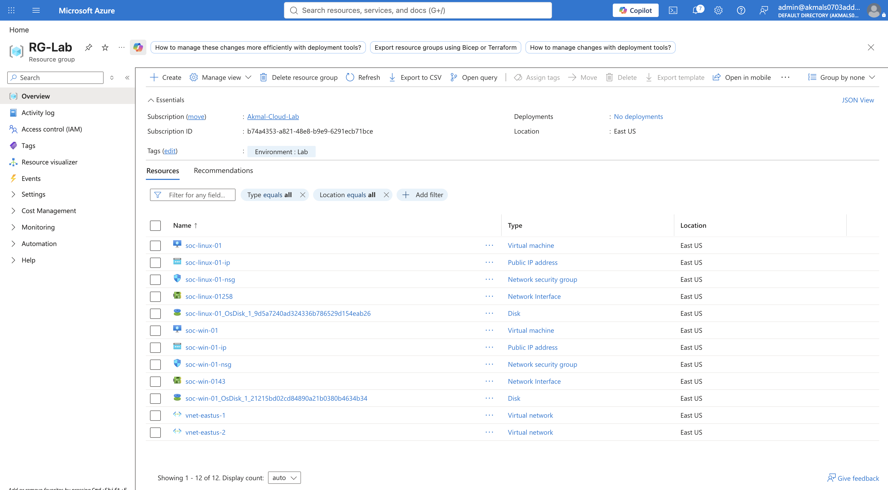
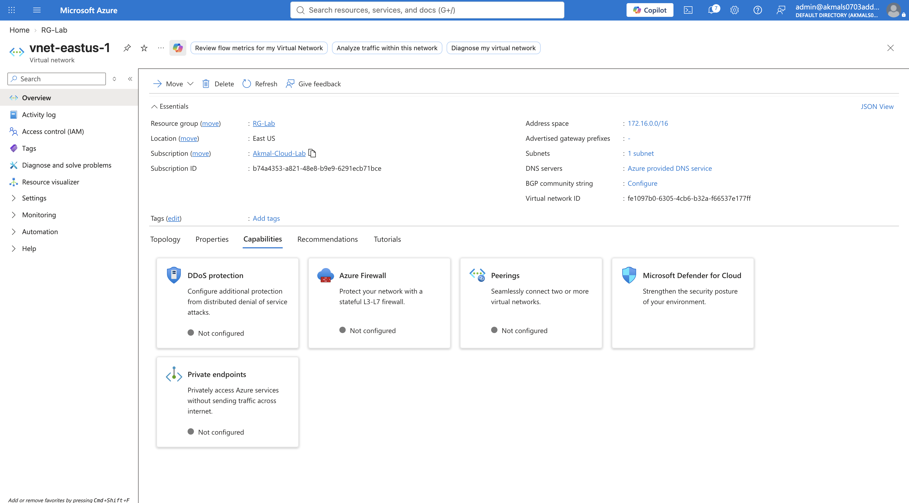
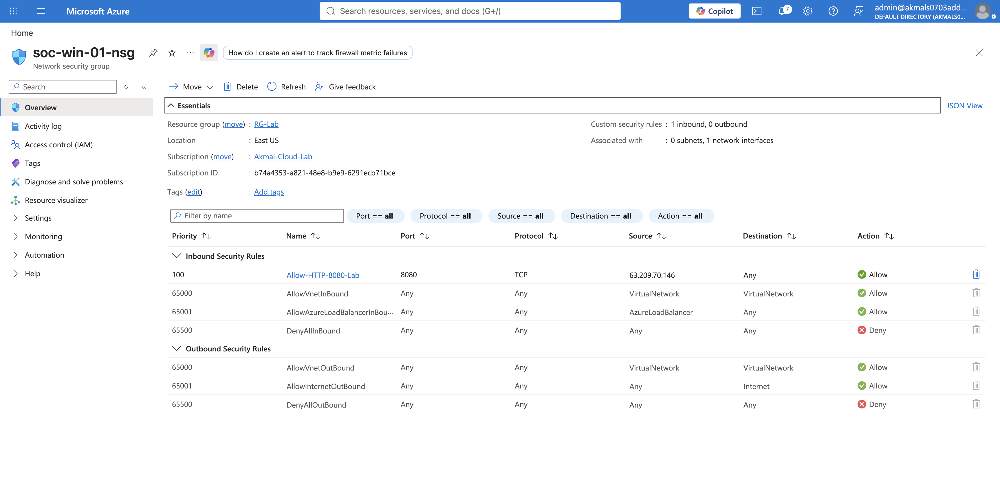
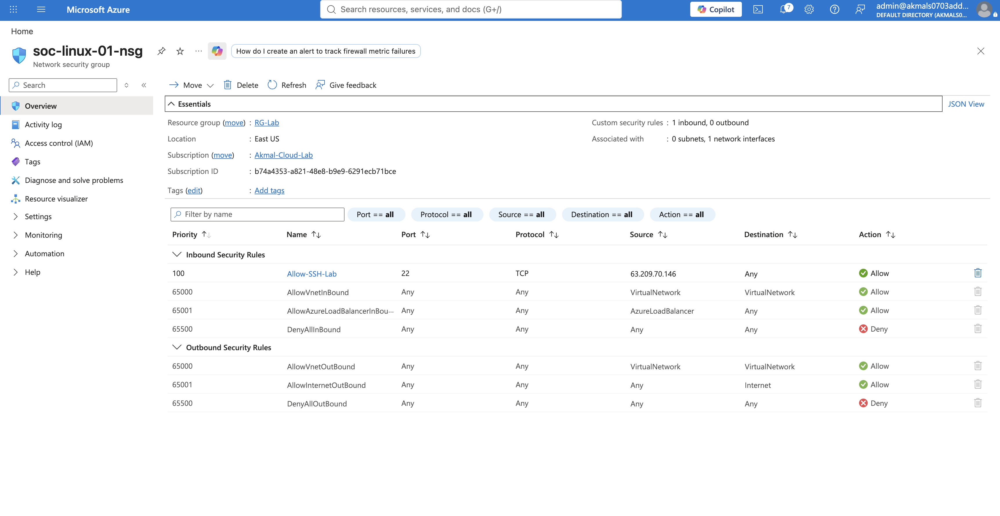
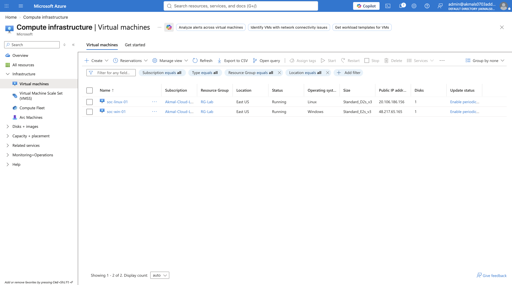

# 01 — Environment Foundation

## Objective

Build a secure Azure environment that can host Windows and Linux systems and later support centralized security telemetry collection and investigation.

## Architecture

Microsoft Entra Tenant
        |
Azure Subscription
        |
Resource Group
        |
Virtual Network
        |
Subnets
        |
Network Security Groups
        |
Azure Bastion
        |
Windows VM + Linux VM
## 1. Microsoft Entra Tenant

### Purpose
A Microsoft Entra tenant is an organization's identity boundary in Microsoft's cloud. It provides the environment where users, groups, applications, identities, and security and access settings are managed.

### What I Configured
I used my Microsoft Entra tenant as the identity boundary for the lab environment. The Azure subscription was associated with this tenant, allowing identities and access permissions within the tenant to be used to manage the Azure resources I deployed.

### Why It Matters
The tenant establishes who can authenticate and provides the identity foundation for controlling access to Azure resources. This becomes important later when applying RBAC, least privilege, and other identity-based security controls.

## 2. Azure Subscription

### Purpose
An Azure subscription provides the billing and resource management boundary where Azure resources are created, organized, managed, and billed.

### What I Configured
I used my Azure subscription as the scope for building the lab environment. Within the subscription, I created Resource Groups, configured networking, deployed Windows and Linux virtual machines, and later connected the environment to Log Analytics for centralized monitoring.

### Why It Matters
Subscriptions allow organizations to separate costs, ownership, access, and operational responsibility across different environments or business units. This makes budgeting, security controls, access management, and day-to-day administration easier to manage as an Azure environment grows.

## 3. Resource Group

### Purpose
A Resource Group is a logical container used to organize and manage related Azure resources within a subscription.

### What I Configured
I created dedicated Resource Groups to logically organize the Azure resources used in my security lab. This allowed related resources to be grouped together and made the environment easier to manage, monitor, and remove when no longer needed.
### Evidence

## 4. Virtual Network

### Purpose
A Virtual Network (VNet) provides a private network boundary in Azure where resources can communicate with each other and connect to other networks under defined routing and security controls.

### What I Configured
I created a VNet to provide private network connectivity for the Windows and Linux virtual machines in the lab. I then divided the VNet address space into subnets so different resources could be logically segmented rather than placing everything into one flat network.

### Why It Matters
The VNet provides the network foundation for the lab. It allows resources to communicate using private networking while giving me control over how traffic enters, leaves, and moves through the environment.

## 5. Subnets

### Purpose
Subnets divide a Virtual Network into smaller network segments so resources can be organized, isolated, and controlled more precisely.

### What I Configured
I divided the VNet into subnets to separate different parts of the lab environment and prepare the network for more controlled traffic management. This gave me a clearer structure for placing resources such as virtual machines and Azure Bastion.

### Why It Matters
Subnets make it easier to apply different network security rules, manage traffic between workloads, and reduce the potential blast radius if one part of the environment is compromised.
### Evidence

## 6. Network Security Groups (NSGs)

### Purpose
Network Security Groups control inbound and outbound network traffic using rules that evaluate the source, source port, destination, destination port, and protocol before allowing or denying the traffic.

### What I Configured
I configured NSG rules to control which traffic could reach resources in the lab environment. Rather than allowing unnecessary inbound access, I restricted management traffic and controlled access based on the services the environment actually required.

### Why It Matters
A resource being connected to a network does not mean every connection should be allowed. NSGs provide network-level access control that helps reduce unnecessary exposure and limits which traffic can reach protected resources.
**Windows VM NSG rules**

**Linux VM NSG rules**

## 7. Azure Bastion

### Purpose
Azure Bastion provides secure administrative access to virtual machines through the Azure portal without requiring RDP or SSH management ports to be directly exposed to the public internet.

### What I Configured
I configured Azure Bastion to access the Windows and Linux virtual machines while keeping direct public access to RDP (3389) and SSH (22) restricted.

### Why It Matters
Exposing management services such as RDP or SSH directly to the internet increases the attack surface by allowing external systems to reach those services. Using Bastion allowed me to administer the virtual machines through their private network connectivity without making those management ports directly internet-facing.

## 8. Windows and Linux Virtual Machines

### Purpose
The virtual machines provide the operating systems where user activity, authentication events, system activity, and other security telemetry are generated.

### What I Configured
I deployed both Windows and Linux virtual machines inside the lab network and accessed them through Azure Bastion instead of exposing RDP or SSH directly to the public internet.

### Why I Used Both Windows and Linux

I intentionally deployed both Windows and Linux because enterprise environments often contain multiple operating systems, and each produces different types of security telemetry.

Windows generates events such as Windows Security Events, while Linux commonly generates Syslog. Working with both systems allowed me to understand how different operating systems generate evidence and how their log ingestion paths differ before the data reaches the monitoring platform.
### Evidence

## Environment Foundation Complete

At this stage, the lab had an identity boundary, Azure resource scope, organized resources, private networking, network security controls, secure administrative access, and both Windows and Linux systems.

However, the environment still had one major limitation from a security operations perspective:

**The systems were generating activity, but I did not yet have centralized visibility into that activity.**
