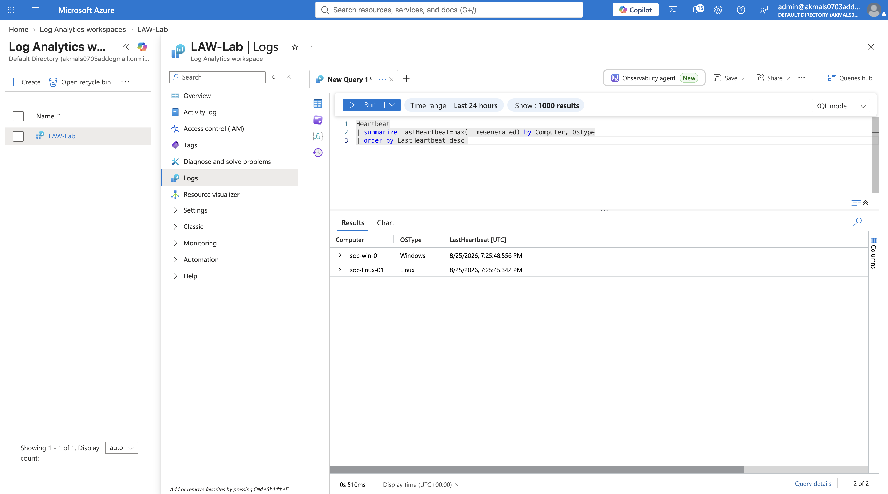
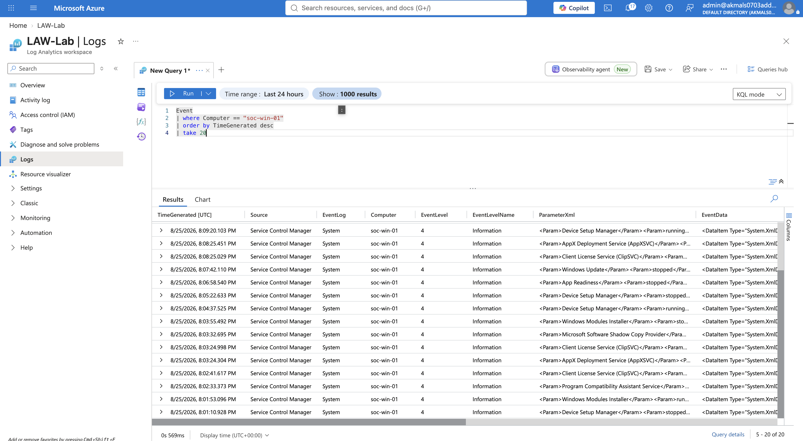
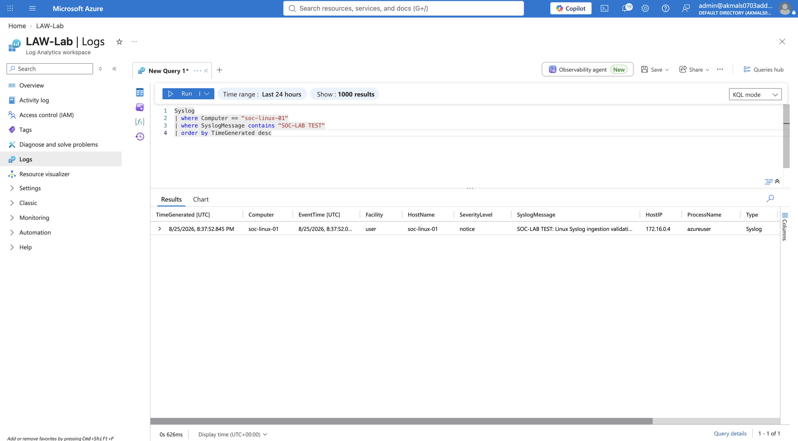
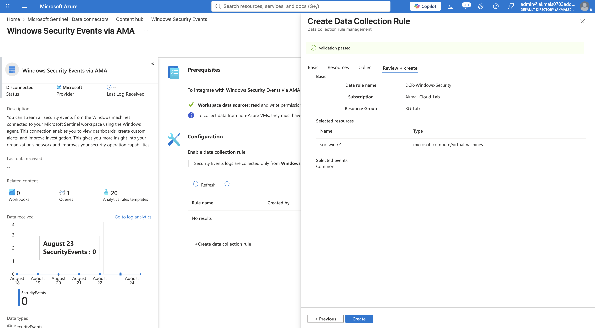
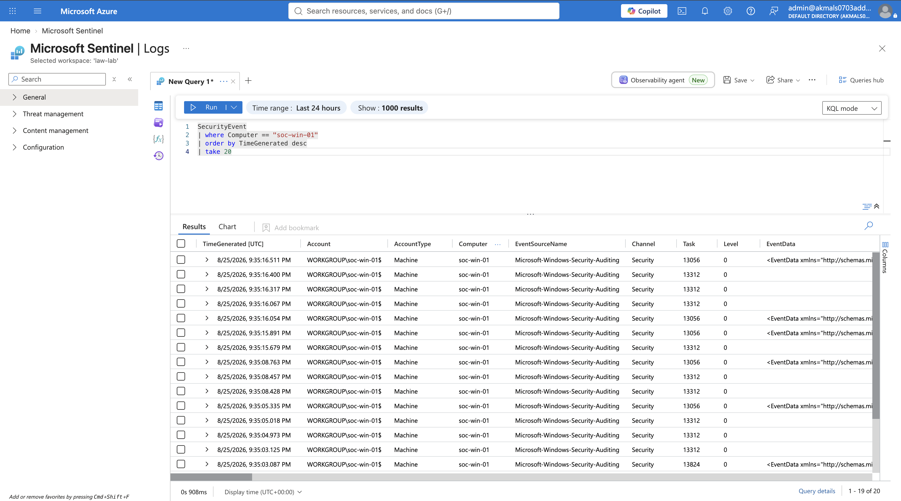
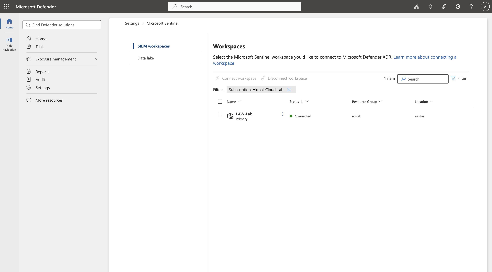
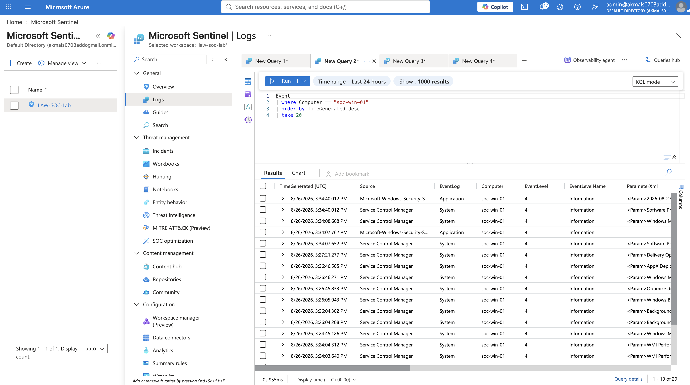

# 02 — Telemetry Ingestion

## Objective

Build and validate an end-to-end telemetry ingestion pipeline that collects Windows and Linux security data, sends it through Azure Monitor Agent and Data Collection Rules, stores it in Log Analytics, and makes it available to Microsoft Sentinel for security monitoring and investigation.

## Architecture

Windows VM + Linux VM  
|  
Azure Monitor Agent (AMA)  
|  
Data Collection Rules (DCR)  
|  
Log Analytics Workspace (LAW)  
|  
Microsoft Sentinel  
|  
SecurityEvent / Event / Syslog / Heartbeat

## 1. Why Centralized Logging Was Needed

Centralized logging is necessary because security investigations become difficult and inefficient when logs are scattered across individual machines.

Bringing telemetry into one place provides centralized visibility, makes it easier to correlate activity across systems, and preserves evidence even if an endpoint is later deleted or compromised.

At scale, centralized logging is what makes continuous monitoring, detection, investigation, and response possible.

## 2. Log Analytics Workspace

### Purpose

Log Analytics Workspace (LAW) provides the centralized location where collected telemetry is stored, organized into tables, and queried using KQL.

### Why It Comes First

AMA can collect telemetry and DCR can define what should be collected, but that data still needs a destination.

The workspace has to exist first so the collection pipeline has somewhere to send and retain the logs.

### Why It Matters

Collecting everything without control would increase ingestion cost and create unnecessary noise. LAW provides the centralized data platform, while AMA and DCR control how telemetry reaches it.

## 3. Azure Monitor Agent (AMA)

### Purpose

Azure Monitor Agent (AMA) is the collection mechanism installed on the monitored machines. It collects telemetry from the operating system and sends that data to the configured Log Analytics Workspace.

### Why It Was Needed

Log Analytics Workspace can store and query telemetry, but it does not collect telemetry directly from the virtual machines.

AMA provides the connection between the endpoint and the centralized logging platform.

### Role in the Pipeline

VM → AMA → DCR → LAW

## 4. Data Collection Rules (DCR)

### Purpose

Data Collection Rules define what telemetry AMA should collect, which sources it should collect from, and where that data should be sent.

### What I Configured

I created DCRs for both Windows and Linux telemetry. For Windows, I selected the event log categories and severity levels I wanted to collect. For Linux, I selected Syslog facilities and severity thresholds.

### Why It Matters

Without a DCR, the agent has no collection policy. Collecting everything would increase ingestion cost and create unnecessary noise, so the rule allows the pipeline to focus on telemetry that has operational and security value.

## 5. Windows and Linux Data Sources

## 5. Windows and Linux Data Sources

### Windows Event Logs

For the Windows VM, I configured AMA and DCR to collect selected Application and System event logs. These events are ingested into the `Event` table in Log Analytics.

Application and System logs provide visibility into operating system and application activity and can contain evidence useful during security investigations.

### Windows Security Events

Windows Security Events were configured separately using the Windows Security Events via AMA integration for Microsoft Sentinel.

These logs contain auditable security activity such as authentication events, account activity, privilege use, policy changes, and other security-relevant actions.

The collected events are stored in the `SecurityEvent` table.

### Linux Syslog

For the Linux VM, I configured AMA and DCR to collect selected Syslog facilities and severity levels.

The collected Linux telemetry is stored in the `Syslog` table in Log Analytics.

### Resulting Tables

| Source | Log Analytics Table |
|---|---|
| Windows Application/System | `Event` |
| Windows Security Events | `SecurityEvent` |
| Linux Syslog | `Syslog` |
| Windows/Linux agent health | `Heartbeat` |

## 6. Validating Agent Communication with Heartbeat

Before validating individual telemetry sources, I first verified that both virtual machines were actively communicating with Azure Monitor.

I queried the `Heartbeat` table and confirmed recent records from both `soc-win-01` and `soc-linux-01`.

Heartbeat provides an important first troubleshooting checkpoint. If a machine is not reporting Heartbeat, troubleshooting individual tables such as `Event`, `SecurityEvent`, or `Syslog` would be premature because the agent communication path itself may not be healthy.

A successful Heartbeat does not prove that every telemetry source is being collected correctly. It confirms that the agent is communicating, allowing troubleshooting to move to the next layer of the ingestion pipeline.

### Evidence

## 7. Troubleshooting Windows Event Ingestion

### Problem

Heartbeat records from `soc-win-01` were successfully reaching Log Analytics, but queries against the `Event` table initially returned no results.

### Investigation

Because Heartbeat was present, I knew the Windows VM and Azure Monitor Agent were communicating with Azure Monitor. This allowed me to focus the investigation on the telemetry collection configuration rather than assuming the entire ingestion pipeline had failed.

I verified:

- Azure Monitor Agent was successfully provisioned on the Windows VM.
- The VM was associated with the correct DCR.
- Windows Application and System logs were configured as data sources.
- `LAW-Lab` was configured as the destination.
- The DCR configuration had been downloaded locally by AMA.

On the Windows VM, I inspected the AMA configuration and confirmed that the downloaded `mcsconfig.latest.xml` contained the expected Windows Event Log subscription.

### Controlled Validation

Instead of continuing to change configuration blindly, I generated a controlled Windows event and queried the `Event` table again.

The event appeared successfully in Log Analytics, confirming the end-to-end collection path:

Windows Event Log → AMA → DCR → LAW → `Event`

### Lesson Learned

A healthy Heartbeat confirms agent communication, but it does not prove that every configured telemetry stream is being collected correctly.

Troubleshooting should validate each layer of the ingestion pipeline independently before changing configuration.

### Evidence

## 8. Validating Linux Syslog Ingestion

### Validation

After confirming AMA was installed and the Linux VM was associated with the DCR, I validated the Syslog collection path using a controlled test message.

From `soc-linux-01`, I generated a Syslog message using:

`logger "SOC-LAB TEST: Linux Syslog ingestion validation"`

I then queried the `Syslog` table in Log Analytics and searched specifically for the generated test message.

The message appeared successfully, validating the complete Linux telemetry path:

Linux VM → Syslog → AMA → DCR → LAW → `Syslog`

### Why This Matters

Seeing records in a table is not enough to prove where they came from. Generating a known test event and finding that same event at the destination provides stronger evidence that the intended ingestion path is working.

### Evidence

## 9. Windows Security Events and Microsoft Sentinel

### Why a Separate Security Collection Path Was Needed

The `Event` table provides Windows Application and System telemetry, which is useful for understanding operating system and application activity.

For SOC investigations, I also needed the dedicated Windows Security audit log. This contains evidence such as successful and failed logons, account activity, privilege use, policy changes, Kerberos activity, and other auditable security events.

### Configuration

I configured Windows Security Events via AMA for `soc-win-01` and created a dedicated Data Collection Rule for security telemetry.

The collection path became:

Windows Security Log → AMA → Windows Security Events DCR → LAW → `SecurityEvent` → Microsoft Sentinel

### Validation

After configuring the security event collection rule, I queried the `SecurityEvent` table and confirmed that Windows Security events from `soc-win-01` were being ingested successfully.

This established a separate security-focused telemetry stream that can later support detection rules, alerts, incidents, and SOC investigations.

### Evidence

## 10. Microsoft Sentinel and Defender Integration

### Purpose

Log Analytics provides the centralized telemetry platform, but Microsoft Sentinel adds the security operations layer needed for detection, alerting, incident management, investigation, and response.

### What I Configured

I enabled Microsoft Sentinel on `LAW-Lab` and connected the workspace to the Microsoft Defender portal.

This allowed the telemetry already being collected in Log Analytics to become available to the broader security operations environment without building a separate ingestion pipeline.

The architecture became:

LAW → Microsoft Sentinel → Microsoft Defender Portal

### Why It Matters

Centralized logs alone do not provide a complete SOC workflow.

Sentinel uses the collected telemetry to support analytics rules, detections, alerts, incidents, investigations, and automation. Connecting the workspace to the Defender portal also provides a unified security operations experience for working with security data across Microsoft products.

### Evidence

## Windows Security Events Collection

Windows telemetry is not a single data stream.

The `Event` table was receiving Windows Application and System logs because those channels had been explicitly configured as data sources in the general DCR.

Windows Security Events are a separate telemetry stream. They contain auditable security activity and require their own collection configuration.

Until I configured Windows Security Events via AMA with a dedicated DCR, the `SecurityEvent` table remained empty.

After the rule was created and associated with `soc-win-01`, Windows Security telemetry began streaming into `SecurityEvent`.

### Troubleshooting Lesson

A healthy `Heartbeat` and populated `Event` table did not mean every Windows telemetry stream was configured.

The missing `SecurityEvent` data was not caused by a broken agent or workspace connection. The security-specific collection rule had simply not been created yet.

This reinforced the importance of validating each telemetry path independently.

### Evidence

