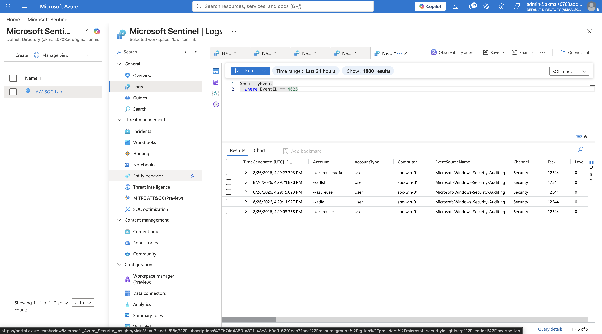
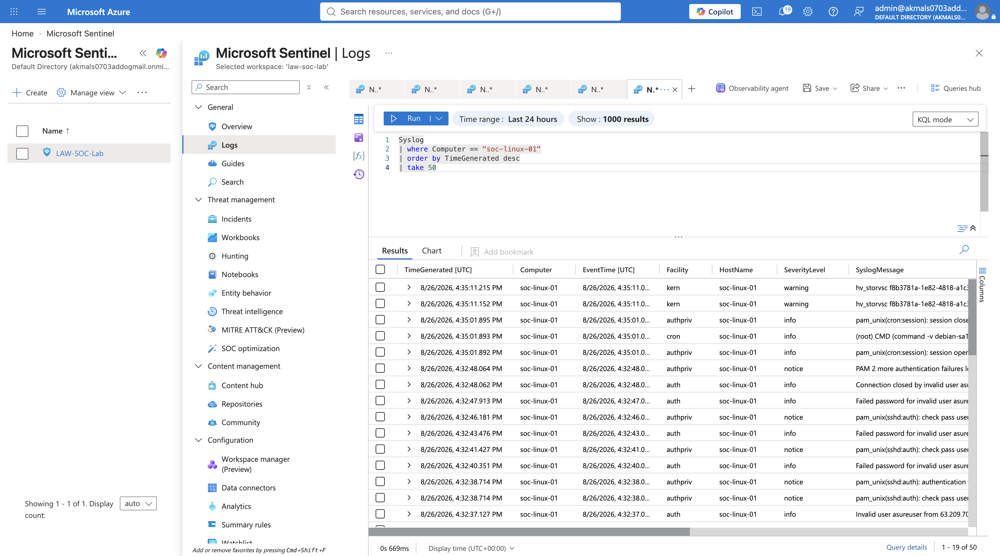
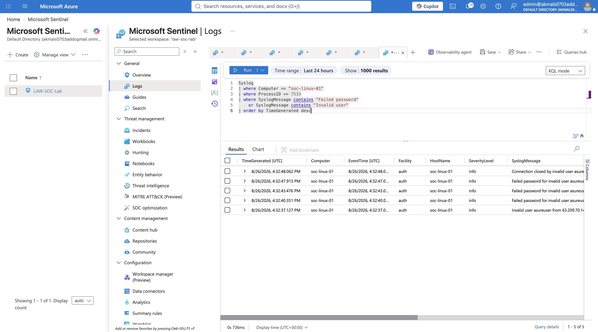
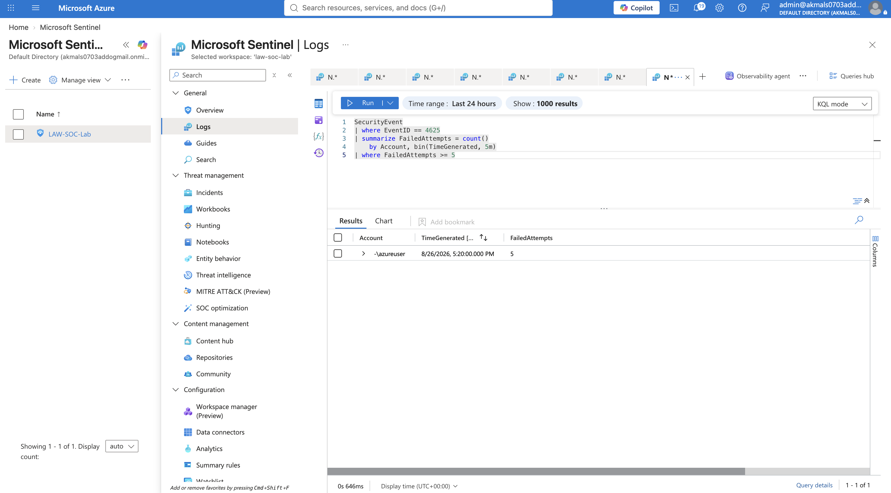
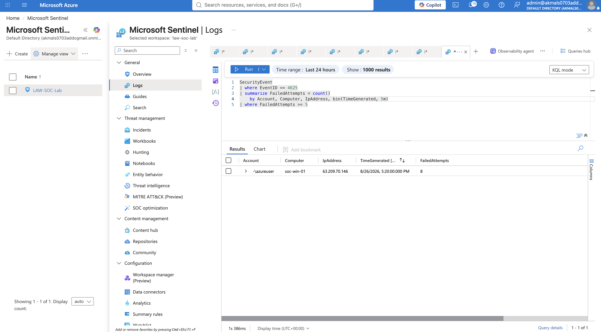
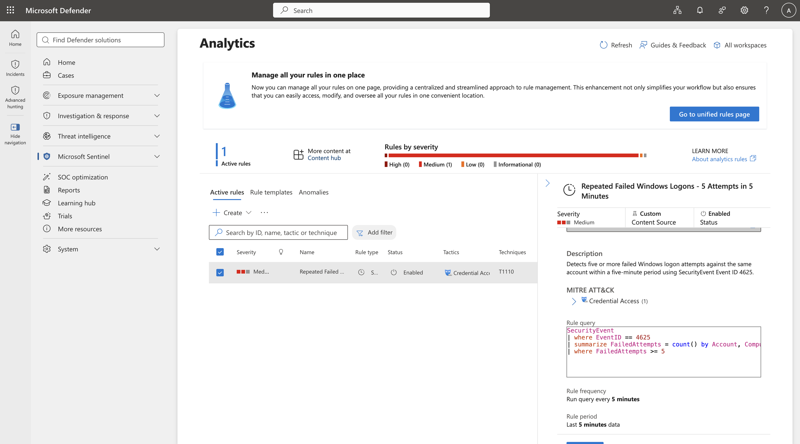
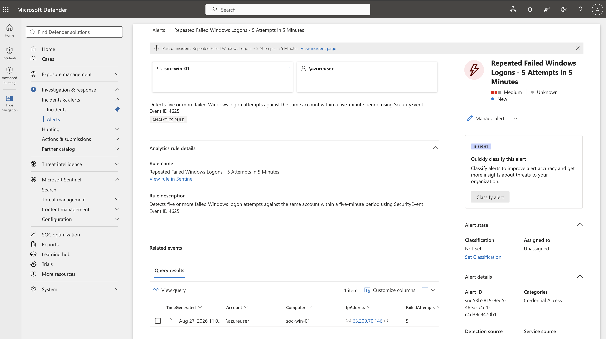

# 03 — Detection Engineering

## 1. Why Detection Engineering Is Needed

Collecting telemetry is only the foundation of security operations. Logs are the raw evidence, but a SOC cannot manually review millions of `Event`, `SecurityEvent`, and `Syslog` records and reliably identify attacks.

The telemetry stream is continuous and dominated by normal activity. Without detection logic, there is no practical way to determine which events deserve attention, recognize meaningful patterns at scale, or prioritize potentially suspicious behavior.

Detection engineering applies security logic to that telemetry so specific behaviors and patterns can be surfaced for analyst review.

The progression becomes:

Telemetry → Detection Logic → Security Signal → Analyst Investigation

## 2. KQL as Detection Logic

The `SecurityEvent` table contains many different types of Windows Security events.

KQL allows me to filter that larger telemetry stream and retrieve only the evidence relevant to a specific security question.

For example, if I want to investigate repeated failed Windows logons, I can use KQL to isolate failed authentication events from the `SecurityEvent` table and then analyze them by account, host, source, and time.

KQL turns a large volume of raw telemetry into a smaller set of events that can be evaluated for suspicious patterns.

## 3. From KQL to an Analytics Rule

A KQL query can identify behavior of interest, but the query alone does not make that behavior malicious or automatically bring it to an analyst's attention.

For example, failed logons are part of normal baseline activity. A user may enter the wrong password several times and then successfully authenticate. Alerting on every individual failure would create unnecessary noise.

An analytics rule operationalizes the detection logic. It can run the KQL query automatically on a defined schedule and evaluate the results against conditions or thresholds that determine when the activity should be surfaced.

This allows the detection to account for patterns such as:

- Number of events
- Activity within a defined time window
- Repeated activity involving the same account or system
- Other conditions defined by the detection logic

When the configured criteria are met, the rule can generate an alert and, depending on its configuration, create an incident for analyst investigation.

The progression becomes:

KQL Query → Analytics Rule → Alert → Incident → Investigation

## 4. First Detection Use Case — Repeated Failed Logons

A single failed logon is common and may represent normal user behavior.

Repeated failed logons against the same account within a short period create a pattern. The pattern does not prove malicious activity, but it increases the significance of the individual events and makes the activity worth surfacing for analyst review.

The purpose of the detection is therefore not to declare an attack. It is to identify behavior that deviates enough from expected activity to justify investigation.

Detection → Attention

Investigation → Conclusion

### Evidence Source

The behavior being detected is a Windows operating-system authentication failure.

Windows records authentication activity in the Security log. After ingestion into Microsoft Sentinel, this telemetry is available in the `SecurityEvent` table.

Windows identifies different types of security activity using Event IDs.

For this detection:

Table → `SecurityEvent`  
Event ID → `4625`  
Meaning → Failed Windows logon

This gives the detection a specific evidence source rather than searching across unrelated telemetry.

### Windows Failed Logon Validation

I generated controlled failed RDP authentication attempts against the Windows VM and queried the `SecurityEvent` table for Event ID `4625`.

This isolated the failed Windows logon activity from the broader Security Event stream and confirmed that the authentication evidence was available for detection logic.

### Evidence



### Linux SSH Failure Validation

I first reviewed recent Syslog activity from the Linux VM to understand the surrounding authentication telemetry.

### Context



I then filtered the telemetry to isolate the failed SSH authentication attempts generated during the controlled test.

### Evidence



## Threshold-Based Failed Logon Detection

After validating individual failed authentication events, I extended the Windows detection logic to identify repeated failures against the same account within a short period.

The query grouped Event ID `4625` records by account and five-minute time window, counted the number of failures, and returned only groups that reached the defined threshold.

```kusto
SecurityEvent
| where EventID == 4625
| summarize FailedAttempts = count()
    by Account, bin(TimeGenerated, 5m)
| where FailedAttempts >= 5
```

### Evidence
The query successfully identified five failed Windows logons against the same account within a five-minute window.



## From Detection Logic to an Analytics Rule

The KQL query defines what behavior should be considered suspicious:

SecurityEvent
| where EventID == 4625
| summarize FailedAttempts = count()
    by Account, Computer, IpAddress, bin(TimeGenerated, 5m)
| where FailedAttempts >= 5

### Preserving Investigation Context

The detection query preserves the account, host, and source IP associated with the failed authentication pattern.

This allows the resulting detection to identify not only that the threshold was exceeded, but also who was targeted, which system received the attempts, and where the activity originated.

These fields can later be mapped to Sentinel entities:

- `Account` → Account
- `Computer` → Host
- `IpAddress` → IP
  ### Evidence

The detection result preserves the targeted account, destination host, source IP address, time window, and failed-attempt count.


### Validation Note
The threshold is `>= 5`, not `== 5`. This run produced 8 failed attempts within the five-minute window, which still correctly triggered the detection and demonstrates that the logic generalizes beyond the exact test case used during initial validation.

## Operationalizing the Detection with a Sentinel Analytics Rule

After validating the KQL detection logic, I converted the query into a scheduled Microsoft Sentinel analytics rule.

The Microsoft Defender Sentinel analytics editor was failing with React error `#185`, so I created the rule directly against the Microsoft Sentinel REST API through Azure Cloud Shell.

This allowed the detection pipeline to continue without changing the detection logic or the Sentinel architecture.

### Rule Configuration

The scheduled rule was configured with:

- **Severity:** Medium
- **MITRE ATT&CK tactic:** Credential Access
- **Technique:** Brute Force (`T1110`)
- **Query frequency:** Every 5 minutes
- **Query lookback:** Last 5 minutes
- **KQL threshold:** `FailedAttempts >= 5`
- **Rule trigger:** Query results `> 0`
- **Incident creation:** Enabled
- **Alert grouping:** Enabled

The KQL threshold determines what behavior is suspicious.

The analytics rule trigger determines whether the query found any suspicious results.

### Entity Mapping

The rule preserved and mapped the investigation context returned by the query:

- `Account` → Account entity
- `Computer` → Host entity
- `IpAddress` → IP entity

This allows Sentinel to treat these values as security objects rather than simple strings and carry them forward into the alert and incident.

### Evidence

The rule was successfully created through the Sentinel REST API and appeared as an enabled scheduled analytics rule in Microsoft Defender.


## Controlled Detection Validation

To validate the complete detection pipeline, I generated multiple failed RDP authentication attempts against the Windows VM using the same account within a five-minute period.

Windows recorded the activity as Security Event ID `4625`, and the events were ingested into the Log Analytics workspace through the existing telemetry pipeline.

I then ran the same KQL logic used by the scheduled analytics rule:

```kusto
SecurityEvent
| where EventID == 4625
| summarize FailedAttempts = count()
    by Account, Computer, IpAddress, bin(TimeGenerated, 5m)
| where FailedAttempts >= 5

## Detection Pipeline — From Telemetry to Incident

```


## Analytics Rule Alert Generated

After the controlled failed-logon activity crossed the KQL threshold, the scheduled Microsoft Sentinel analytics rule executed and generated a security alert.

The alert preserved the investigation context returned by the query:

- **Account:** `\azureuser`
- **Host:** `soc-win-01`
- **Source IP:** `63.209.70.146`
- **Failed attempts:** `5`
- **Severity:** Medium
- **Category:** Credential Access

This confirmed that the detection logic had moved beyond manual query validation and was operating automatically as a Sentinel security detection.

### Evidence


                    RAW SECURITY TELEMETRY
                              │
              ┌───────────────┴───────────────┐
              ▼                               ▼
           WINDOWS                          LINUX
        SecurityEvent                       Syslog
              │                               │
       Event ID 4625                  SSH authentication
              │                        message evidence
              ▼                               ▼
     Controlled failed RDP            Controlled failed SSH
        logons generated                logons generated
              │                               │
              ▼                               ▼
     KQL isolated failures             KQL isolated failures
              │                               │
              └───────────────┬───────────────┘
                              ▼
                  INDIVIDUAL EVENTS ARE
                    NOT YET A DETECTION
                              │
                              ▼
                    DEFINE THE PATTERN
                              │
                     Same Account
                          +
                     Short Time
                          +
                    Multiple Failures
                              │
                              ▼
                       KQL DETECTION
                              │
                 SecurityEvent / 4625
                              │
                    Group by Account
                              │
                  bin(TimeGenerated, 5m)
                              │
                   Count failed attempts
                              │
                    FailedAttempts >= 5
                              │
                              ▼
                    THRESHOLD VALIDATED
                              │
                  5+ failures surfaced
                              │
                              ▼
                 PRESERVE INVESTIGATION
                         CONTEXT
                              │
              ┌───────────────┼───────────────┐
              ▼               ▼               ▼
           Account         Computer        IpAddress
              │               │               │
             WHO?           WHERE?        FROM WHERE?
              │               │               │
              ▼               ▼               ▼
           Account           Host              IP
            Entity          Entity           Entity
              └───────────────┬───────────────┘
                              ▼
                       ENTITY MAPPING

              "These aren't just strings —
               these are security objects."
                              │
                              ▼
                    ANALYTICS RULE DESIGN
                              │
          ┌───────────────────┼───────────────────┐
          ▼                   ▼                   ▼
      Severity             MITRE              Schedule
       Medium          Credential Access     Every 5 min
                         Brute Force          Look back 5m
                           (T1110)
                              │
                              ▼
                       TWO DIFFERENT
                         THRESHOLDS
                              │
              ┌───────────────┴───────────────┐
              ▼                               ▼
        KQL THRESHOLD                  RULE TRIGGER
    FailedAttempts >= 5              Query results > 0
              │                               │
              ▼                               ▼
   "What looks suspicious?"          "Did KQL find any?"
              └───────────────┬───────────────┘
                              ▼
                         RULE FIRES
                              │
                              ▼
                            ALERT
                              │
                 Account / Host / IP
                              │
                              ▼
                       ALERT GROUPING
                              │
              Are repeated alerts related?
                          Shared entities
                              │
                              ▼
                           INCIDENT
                    Container for investigation
```

**Note:** Rule creation for this environment was completed through the
Microsoft Defender portal's Sentinel analytics editor, since standalone
Azure Sentinel rule creation has been migrated there. The classic Azure
portal Sentinel blade was used earlier in this section for query
development and validation.
