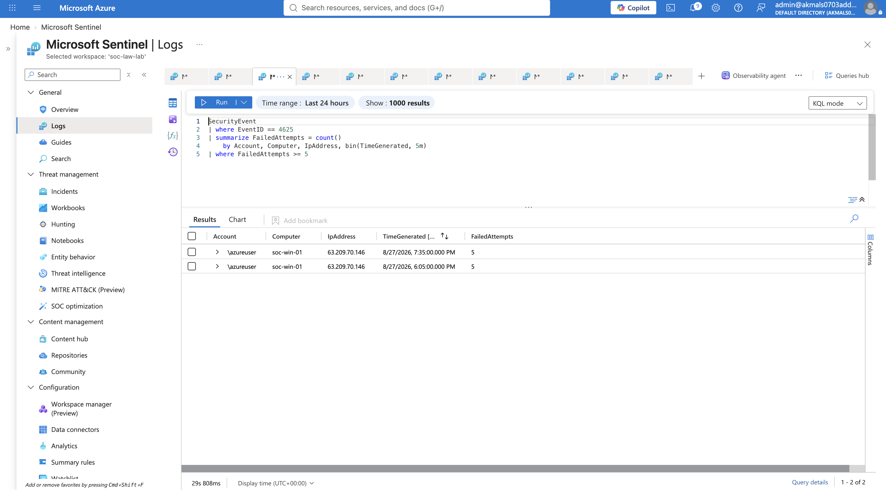
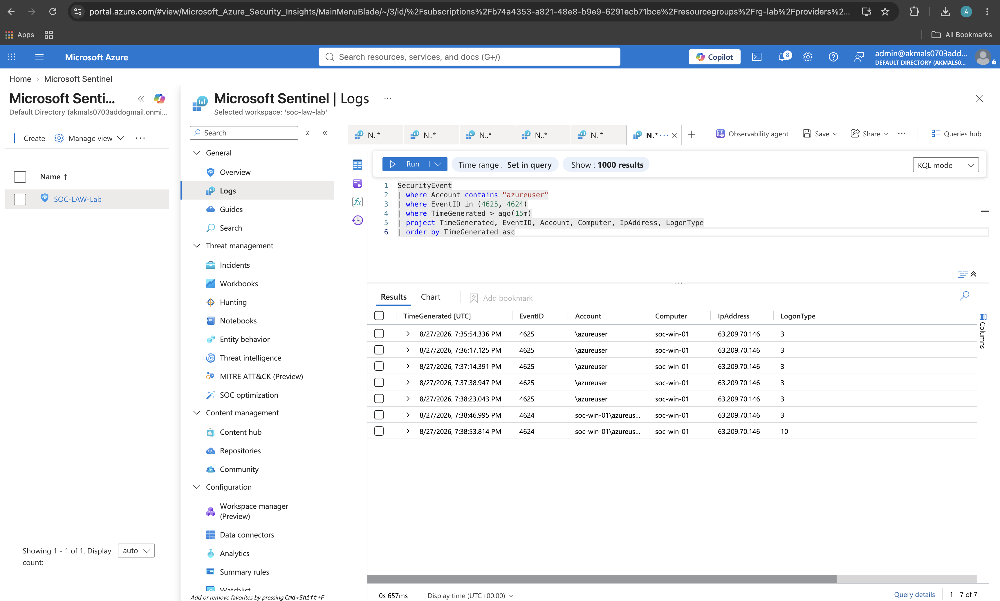
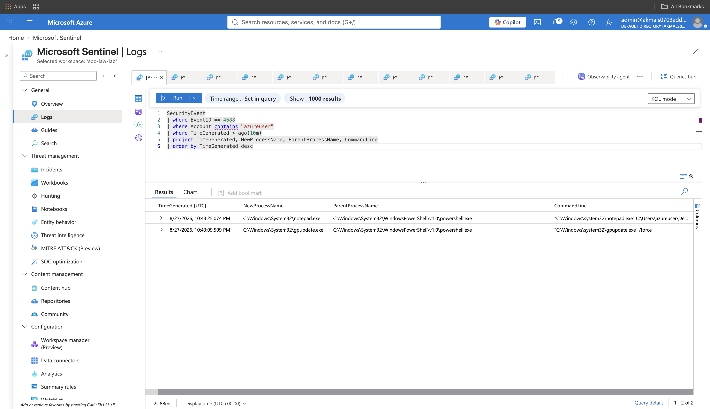
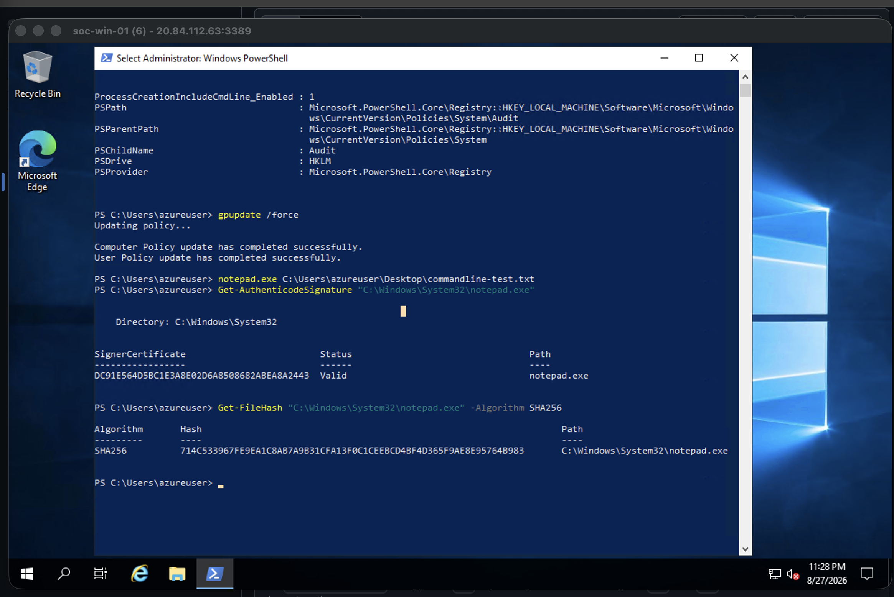
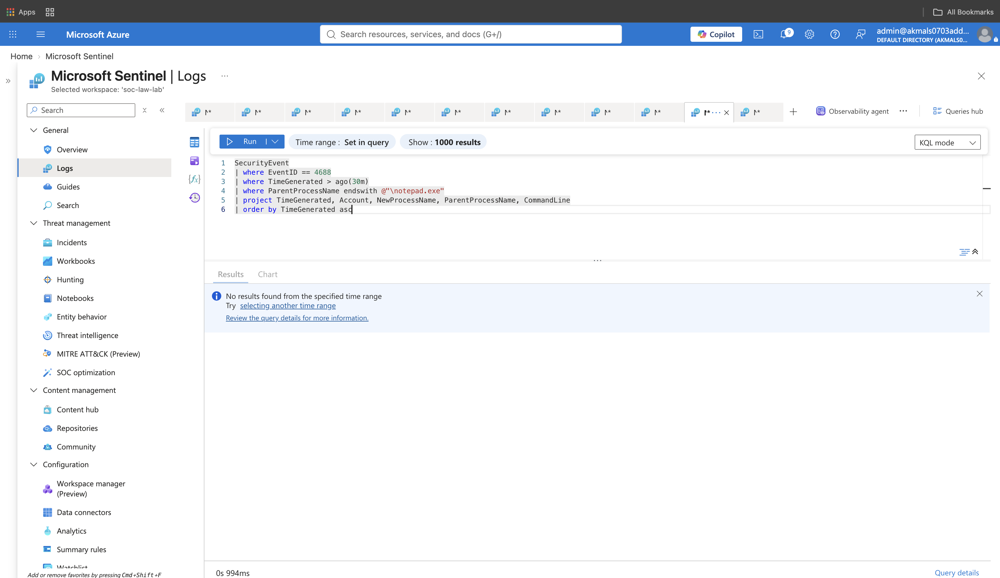

# Failed RDP Logons to Post-Authentication Process Investigation

## Investigation Objective

This investigation began with repeated failed Windows RDP authentication attempts against a lab Windows host.

The goal was not to immediately classify the activity as malicious. Instead, the investigation followed the available evidence to answer:

- Which account was targeted?
- Which host received the authentication attempts?
- Where did the attempts originate?
- Did authentication eventually succeed?
- If authentication succeeded, what type of logon occurred?
- What activity occurred on the host afterward?
- Were processes created?
- What process launched them?
- What commands were executed?
- Did the observed executable appear legitimate?
- Did the process spawn additional processes?

The investigation followed this reasoning model:

**Alert → Question → Evidence → Interpretation → Next Question**

## Initial Detection

A Microsoft Sentinel scheduled analytics rule detected repeated failed Windows logon attempts against the lab Windows host.

The detection logic searched the `SecurityEvent` table for:

**Event ID 4625 — Failed Logon**

```kusto
SecurityEvent
| where EventID == 4625
| summarize FailedAttempts = count()
    by Account, Computer, IpAddress, bin(TimeGenerated, 5m)
| where FailedAttempts >= 5
```
### Detection Evidence

The query returned repeated five-attempt authentication clusters for the same account, host, and source IP.

Observed entities included:

- **Account:** `\azureuser`
- **Computer:** `soc-win-01`
- **Source IP:** `63.209.70.146`
- **Failed attempts:** `5`



## Did Authentication Eventually Succeed?

Repeated failed logons do not prove that an account was compromised.

The next investigation question was:

> **Did the same account successfully authenticate after the failed attempts?**

Relevant Windows Security Event IDs:

- **4625** — Failed logon
- **4624** — Successful logon

The following query was used to place failed and successful authentication events into chronological order:

```kusto
SecurityEvent
| where Account contains "azureuser"
| where EventID in (4625, 4624)
| where TimeGenerated > ago(15m)
| project TimeGenerated, EventID, Account, Computer, IpAddress, LogonType
| order by TimeGenerated asc
```
### Authentication Sequence Evidence

The timeline showed five failed logon events followed by successful authentication events for the same source IP and host.

The final successful event included:

- **Event ID:** `4624`
- **Logon Type:** `10`
- **Meaning:** RemoteInteractive / RDP
- **Host:** `soc-win-01`
- **Source IP:** `63.209.70.146`

This changed the investigation from:

> Why are authentication attempts failing?

to:

> Did the repeated authentication attempts eventually result in successful remote access?



## What Happened After the Successful RDP Login?

Once successful remote authentication was confirmed, the investigation moved from authentication activity into host activity.

The next question was:

> **Were any new processes created after the successful login?**

Windows process creation activity is recorded using:

**Event ID 4688 — A new process has been created**

### Process Creation Evidence

Event ID `4688` was used to examine process creation activity on the host.

The results showed several processes created under the `azureuser` context, including:

- `notepad.exe`
- `powershell.exe`
- `auditpol.exe`

The parent process relationship provided additional context.

For example, `notepad.exe` was observed with different parent processes, including:

- `explorer.exe`
- `powershell.exe`

This demonstrated why the process name alone is not enough to interpret activity. The parent-child relationship helps explain how the process was started.


## What Was the Process Told to Do?

Knowing which process ran and what launched it still did not explain the full activity.

The next question was:

> **What command or arguments were supplied to the process?**

The `CommandLine` field in Event ID `4688` was initially empty because Windows was not configured to include command-line information in process creation events.

Command-line process auditing was then enabled, and new process creation activity was generated for validation.

### Command-Line Evidence

After command-line process auditing was enabled, new Event ID `4688` records included the instructions supplied to each process.

A controlled test produced the following relationship:

- **Process:** `notepad.exe`
- **Parent:** `powershell.exe`
- **Command line:** Notepad was launched with the path to `commandline-test.txt`

Another observed event showed:

- **Process:** `gpupdate.exe`
- **Parent:** `powershell.exe`
- **Command line:** `gpupdate.exe /force`

The `gpupdate.exe /force` execution was consistent with the known administrative activity performed during the lab after configuring command-line auditing.

This does not mean that `gpupdate.exe /force` is inherently benign. The interpretation came from the surrounding investigation context.



## Is the Executable What It Claims to Be?

After identifying what ran, who launched it, and what command was supplied, the next question was:

> **Is the observed executable itself legitimate?**

The investigation evaluated three pieces of file identity evidence:

1. Executable path
2. Digital signature
3. SHA-256 hash

### Executable Path

The observed Notepad executable ran from:

`C:\Windows\System32\notepad.exe`

This was consistent with the expected Windows system location.

However, an expected path alone was not treated as proof that the process was legitimate.

### Digital Signature Validation

The executable's Authenticode signature was checked directly on the Windows host:

```powershell
Get-AuthenticodeSignature "C:\Windows\System32\notepad.exe"
```
The result showed:

- **Path:** `notepad.exe`
- **Signature status:** `Valid`
- **Signer certificate:** Present

A valid digital signature increased confidence that the executable was an authentic signed Windows binary.

However, a valid signature was not treated as proof that the process activity itself was benign. Legitimate signed binaries can still be used in suspicious activity.

### SHA-256 Hash Collection

The SHA-256 hash of the same executable was collected:

```powershell
Get-FileHash "C:\Windows\System32\notepad.exe" -Algorithm SHA256
```
The hash provides a cryptographic fingerprint of the exact file observed during the investigation.

The hash was collected for potential comparison against a trusted known-good baseline or threat-intelligence source.

Because no external known-good comparison was performed during this investigation, the hash itself was not treated as a benign verdict.


## Did the Process Spawn Any Child Processes?

After examining the executable path, digital signature, and file hash, the next question was:

> **Did `notepad.exe` create any additional processes?**

The following query searched Event ID `4688` for processes where Notepad appeared as the parent:

```kusto
SecurityEvent
| where EventID == 4688
| where TimeGenerated > ago(30m)
| where ParentProcessName endswith @"\notepad.exe"
| project TimeGenerated, Account, NewProcessName, ParentProcessName, CommandLine
| order by TimeGenerated asc
```
### Child Process Finding

The query returned no matching Event ID `4688` records where `notepad.exe` appeared as the parent process during the observed time window.

This supports the following conclusion:

> **No child processes were observed spawning from `notepad.exe` during the queried period.**

This does not prove that Notepad could never spawn another process or that no child activity occurred outside the available telemetry window. It only reflects what was observed in the collected evidence.



## Investigation Summary

This investigation began with a Microsoft Sentinel detection for repeated failed Windows logons.

The investigation then followed the evidence step by step:

1. Repeated failed logons were identified using Event ID `4625`.
2. A later successful authentication was identified using Event ID `4624`.
3. Logon Type `10` confirmed the successful event was a RemoteInteractive / RDP logon.
4. Post-authentication host activity was examined using Event ID `4688`.
5. Process creation telemetry showed what ran and which parent process launched it.
6. Command-line auditing revealed what instructions were supplied to the process.
7. The executable path was checked.
8. The digital signature was validated.
9. The SHA-256 hash was collected.
10. Child-process activity was queried and no child processes were observed from `notepad.exe` during the investigated window.

The investigation reinforced an important principle:

> **A process name alone is not enough. Context determines meaning.**

The filename tells us what the executable claims to be. The surrounding evidence helps determine what it actually did.

## Evidence vs Interpretation

The investigation deliberately separated observed evidence from assumptions.

### Observed Evidence

- Multiple failed Windows logons were recorded.
- The failures involved `\azureuser`.
- The target host was `soc-win-01`.
- The observed source IP was `63.209.70.146`.
- A successful Windows logon followed the failures.
- The successful RDP event had Logon Type `10`.
- Process creation events were observed using Event ID `4688`.
- `powershell.exe` launched `notepad.exe` during the controlled test.
- Command-line telemetry showed the arguments supplied to the process.
- `notepad.exe` ran from `C:\Windows\System32\notepad.exe`.
- The executable returned a `Valid` Authenticode signature.
- A SHA-256 hash was collected.
- No child processes were observed spawning from `notepad.exe` during the queried window.

### What the Evidence Does Not Prove

The evidence does not by itself prove:

- the account was compromised,
- the successful logon was unauthorized,
- the observed process activity was malicious,
- a valid signature means the behavior was safe,
- the collected hash is known-good without comparison,
- or that no child activity occurred outside the available telemetry window.

## Current Investigation Status

Completed:

- Failed logon detection
- Successful authentication correlation
- RDP logon-type validation
- Process creation investigation
- Parent-process analysis
- Command-line analysis
- Executable path review
- Digital signature validation
- SHA-256 hash collection
- Child-process investigation

Not yet investigated:

- Network activity

The network-activity portion is intentionally deferred to the next investigation session rather than introducing new telemetry into this case prematurely.
